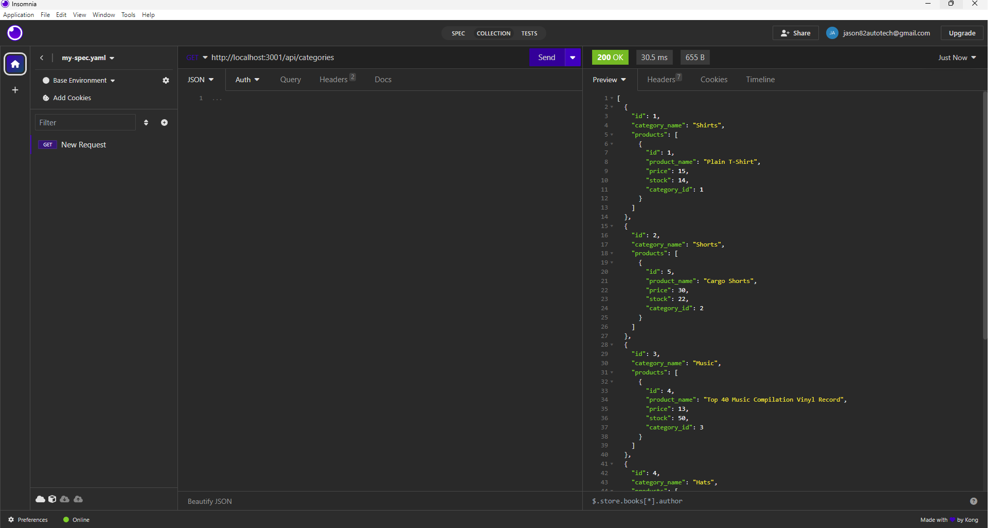

# 13 Object-Relational Mapping (ORM): E-Commerce Back End

Module 13 Object-Relational Mapping (ORM): E-Commerce Back End


## Contents
[Description](#description)

[User Story](#user-story)

[Acceptance Criteria](#acceptance-criteria)

[Installation](#installation)

[Usage](#usage)

[Images](#images)

---

## Description 
The task at hand is to create the backend code for an e-commerce website. We have been given some initial code to start with. Our objective is to set up an Express.js API and configure it to use Sequelize, which is a powerful tool for interacting with a MySQL database. By doing this, we will be able to effectively communicate with the database and perform various operations required for the e-commerce site.

### User Story
```md
AS A manager at an internet retail company
I WANT to implement a modern and technologically advanced backend for our e-commerce website.
SO THAT our company can stay competitive in the market, as we will leverage the latest technologies in our backend system.
```

### Acceptance Criteria 
```md
GIVEN a functional Express.js API
WHEN I add my database name, MySQL username, and MySQL password to an environment variable file
THEN I am able to connect to a database using Sequelize
WHEN I enter schema and seed commands
THEN a development database is created and is seeded with test data
WHEN I enter the command to invoke the application
THEN my server is started and the Sequelize models are synced to the MySQL database
WHEN I open API GET routes in Insomnia for categories, products, or tags
THEN the data for each of these routes is displayed in a formatted JSON
WHEN I test API POST, PUT, and DELETE routes in Insomnia
THEN I am able to successfully create, update, and delete data in my database
```

## Installation
```
npm i
```

## Usage
```
mysql -u root -p 
enter password
source db/schema.sql
exit
npm run seed
node server.js
```

Testing of the code was completed in Insomnia


## Images


## Review

You are required to submit BOTH of the following for review:

* A walkthrough video demonstrating the functionality of the application and all of the acceptance criteria being met: https://drive.google.com/file/d/1Ue1TQ-c_dJ3xTl5KspORlgVREdk4DVhk/view


* The URL of the GitHub repository. Give the repository a unique name and include a readme describing the project: https://github.com/jason82autotech/E-Commerce-Back-End

* All work is my own with the help of the awesome tutors and classmates I have! I also used Google, You Tube, MDN Docs, W3 Schools, Chat GPT, Cody Ai, and any other resource I could find on the web.


---
© 2023 edX Boot Camps LLC. Confidential and Proprietary. All Rights Reserved.

